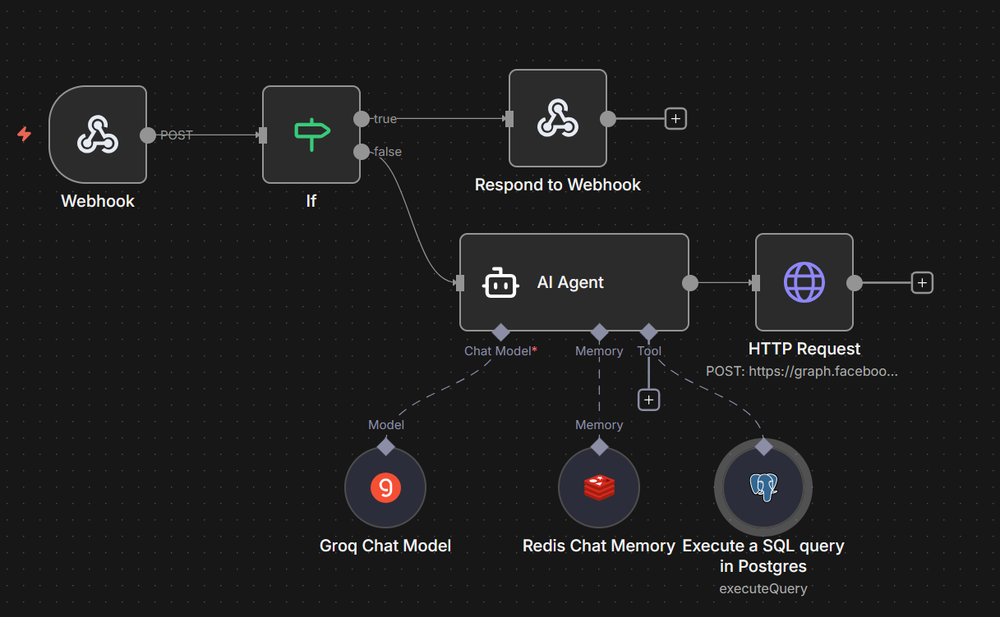

# WhatsApp AI Bot with n8n

Conversational WhatsApp bot integrated with artificial intelligence, persistent memory, and PostgreSQL database querying.

## Workflow Diagram



## Overview

This workflow receives WhatsApp messages through the Meta API, processes them using an AI agent (Groq) with conversational memory (Redis), and has the ability to query permit/expedition information from a PostgreSQL database.

## Workflow Architecture

```
Webhook (POST)
    │
    ▼
IF (Is it a Meta verification request?)
    │
    ├── YES (GET with hub.challenge) ──► Respond to Webhook (returns hub.challenge)
    │
    └── NO (real message) ──► AI Agent ──► HTTP Request (WhatsApp API) ──► Respond OK
```

### AI Agent Sub-nodes
- **Groq Chat Model** – Language model `llama-3.3-70b-versatile`
- **Redis Chat Memory** – Conversational history with 24-hour TTL
- **Postgres Tool** – Expedition/permit database queries

## Workflow Nodes

### 1. Webhook
- **Type**: `n8n-nodes-base.webhook`
- **HTTP Method**: POST
- **Path**: `whatsapp-bot`
- **Production URL**: `https://YOUR-DOMAIN/webhook/whatsapp-bot`
- **Response Mode**: `responseNode`
- **Function**: Entry point of the workflow. Receives both Meta verifications (GET) and incoming messages (POST).

### 2. IF (Conditional)
- **Type**: `n8n-nodes-base.if`
- **Condition**: Checks if `query['hub.challenge']` exists
- **Function**: Splits the flow between Meta's initial verification and real WhatsApp messages.

### 3. Respond to Webhook (Verification)
- **Type**: `n8n-nodes-base.respondToWebhook`
- **Response**: Returns the `hub.challenge` value
- **Content-Type**: `text/plain`
- **Function**: Responds to Meta's webhook verification request during setup.

### 4. AI Agent
- **Type**: `@n8n/n8n-nodes-langchain.agent`
- **Prompt**: Text from the incoming WhatsApp message
- **Function**: AI agent that decides which tool to use based on the user's message.
- **Connected sub-nodes**:
  - Groq Chat Model (language model)
  - Redis Chat Memory (conversational memory)
  - Postgres Tool (expedition queries)

### 5. Groq Chat Model
- **Type**: `@n8n/n8n-nodes-langchain.lmChatGroq`
- **Model**: `llama-3.3-70b-versatile`
- **Function**: Language model that processes and generates the agent's responses.

### 6. Redis Chat Memory
- **Type**: `@n8n/n8n-nodes-langchain.memoryRedisChat`
- **Session Key**: Sender's phone number (`messages[0].from`)
- **TTL**: `86400` seconds (24 hours)
- **Function**: Stores the conversation history per user. Each phone number has its own independent thread that automatically expires after 24 hours.

### 7. Postgres Tool (Execute SQL Query)
- **Type**: `n8n-nodes-base.postgresTool`
- **Description**: Queries record information from the database
- **Query**:
```sql
SELECT id, status, created_at, name
FROM your_table
WHERE id = '{{ $fromAI("record_id", "The record identifier to query") }}'
```
- **Function**: Allows the agent to query records in PostgreSQL. The agent automatically extracts the identifier from the user's message using `$fromAI`. Adapt the query to your own table structure.

### 8. HTTP Request (WhatsApp API)
- **Type**: `n8n-nodes-base.httpRequest`
- **Method**: POST
- **URL**: `https://graph.facebook.com/v20.0/{PHONE_NUMBER_ID}/messages`
- **Headers**:
  - `Authorization: Bearer {ACCESS_TOKEN}`
  - `Content-Type: application/json`
- **Function**: Sends the AI Agent's response back to the WhatsApp user.

### 9. Respond to Webhook (OK)
- **Type**: `n8n-nodes-base.respondToWebhook`
- **Response**: `OK` with status `200`
- **Function**: Confirms to Meta that the message was received successfully.

## Prerequisites

### Required External Services
- **Meta for Developers**: App with WhatsApp Business API configured
- **Groq**: API key for the language model
- **Redis**: Redis instance (Upstash recommended for free tier)
- **PostgreSQL**: Database with the `your_database_table` table

### Required Credentials in n8n
| Credential | Node | Description |
|---|---|---|
| `groqApi` | Groq Chat Model | Groq API key |
| `redis` | Redis Chat Memory | Redis connection (host, port, password, SSL) |
| `postgres` | Postgres Tool | PostgreSQL connection |

## Variables to Configure

Before activating the workflow, replace these values:

| Variable | Location | Description |
|---|---|---|
| `PHONE_NUMBER_ID` | HTTP Request URL | Phone number ID in Meta |
| `ACCESS_TOKEN` | HTTP Request Header | Meta access token (expires every 24h) |

## Meta for Developers Setup

1. Create an app at [Meta for Developers](https://developers.facebook.com)
2. Add the **WhatsApp** product
3. Configure the webhook with the production URL: `https://YOUR-DOMAIN/webhook/whatsapp-bot`
4. Subscribe to the **messages** field in the webhook settings
5. Add and verify your destination phone number in the authorized numbers section

> **Important**: Apps in development mode only accept messages from previously authorized numbers. To receive messages from any number, you must publish the app.

## Important Notes

- The **temporary access token** from Meta expires every 24 hours. For production, it is recommended to configure a permanent **System User Token** from Meta Business Manager.
- The workflow must be **active** (green toggle) for the production URL to work.
- In test mode (`webhook-test`), it only works while n8n is in manual listening mode.
- The **Pinecone Vector Store** node is included but disabled, ready for future RAG document integration.

## Incoming WhatsApp Data Structure

```json
{
  "body": {
    "entry": [{
      "changes": [{
        "value": {
          "messages": [{
            "from": "573001234567",
            "text": {
              "body": "user message"
            }
          }]
        }
      }]
    }]
  }
}
```

## Potential Future Improvements

- Integration with **Pinecone** or **pgvector** for document RAG
- Support for **audio messages** with transcription via Whisper
- Internet search with **Tavily**
- Permanent Meta token via System User
- Handling of different message types (image, document, location)
